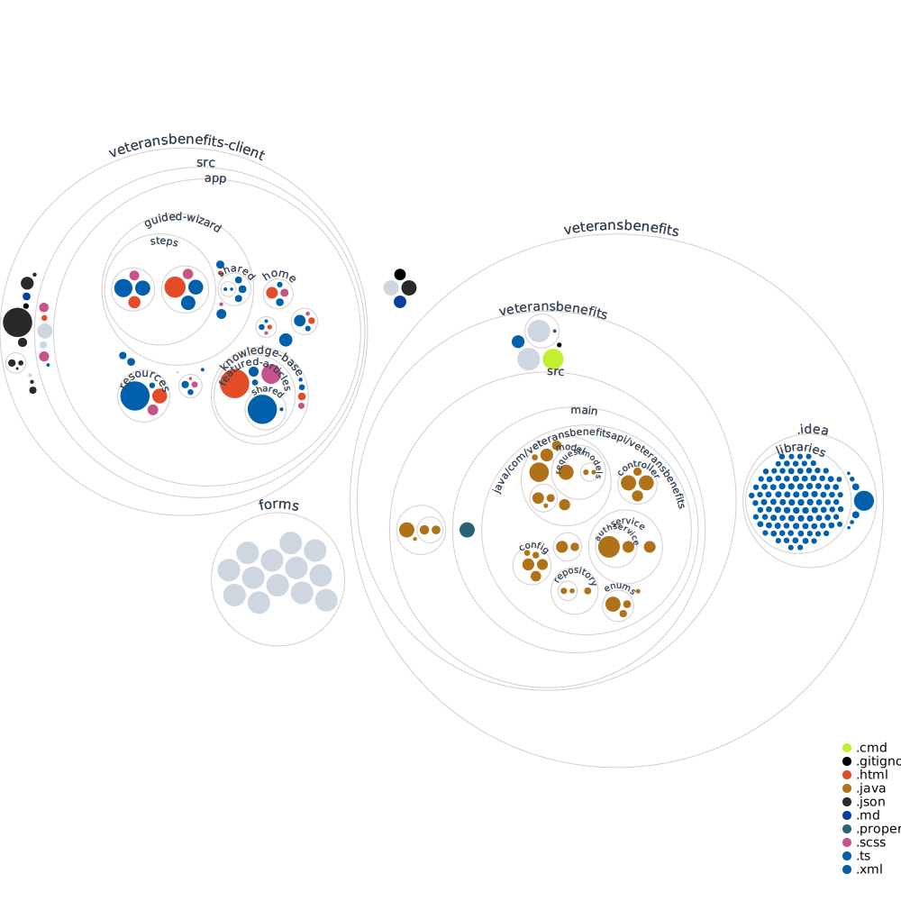

# VeteransBenefits

## Project Repo for r/VeteransBenefits Project
For detailed code documentation generated by Doxygen, please visit [our Doxygen documentation](https://veteransbenefits-uno-team.github.io/USVBN/html/index.html), hosted on the `gh-pages` branch of this repository.

### V1 - Code Milestone 1

This application currently functions as the foundation for our website and is aimed to help gather aid for Veterans, something that is typically made overly complex and confusing. Our goal with this website and project as a whole is to make sure that Veterans have an easier system and congregation of information to gather benefits for their service.

**Release Notes:** Basic frontend and backend functionality. Refinement towards desired functionality in progress.

_Note: There currently only exists a main branch for this application which contains all code and resources worked on so far._

### V2 - Code Milestone 2

At this point, our program has a mostly working front-end, and we are progressing on the questionnaire part of the front end to determine veteran information and get information for what forms the user will be eligible for. We have made improvements to the style and static information available on this page and now have basic functionality for all pages our front end is expected to have.

**Release Notes:** Improved frontend functionality, refined styles and design of frontend, and beginning of work on questionnaire.

### V3 - Code Milestone 3

The frontend for our application has made great strides, the questionnaire is nearing completion and most other elements of our frontend are in the polishing stages right now. We have set up a connection between the front and back ends of our web application and should now be able to send data between each of them. We are beginning work on the backend of our application including processing the questionnaire results, determining eligibility for forms, autofilling forms with data obtained from the questionnaire, and also storing data on the client side using IndexDB.

**Release Notes:** More polished frontend, connection between front and back ends, and beginning stages of backend processing and client-side storage.

### V4 - Code Milestone 4

We have decided to use MySQL database tables for external storage instead of IndexDB. The FAQ page is now functioning as expected, buttons will now display the answers to questions and the search bar is working as we expect it to. On the backend, there are now objects to represent all user data, forms, and form requirements. The backend also has basic functionality for filling out the fields of a form, saving the updated form, and displaying the URL of the updated form so the result can be viewed. More progress has been made on the stepper and documentation of the project as well.

**Release Notes:** Better documentation, FAQ page is functioning properly, basic functionality for filled out and saving forms, and better documentation.

### V5 - Code Milestone 5

This final milestone mainly consisted of polishing UI features and fixing issues we had with certain features. This mainly included the PDF download page and adding to the resources and knowledge base. We also worked on setting up the configuration for deployment on the Odin VM if we were to ever want to deploy the application in the future to a domain.

**Release Notes:**
- Enhanced UI for a better user experience.
- Refined PDF download functionality for ease of document access.
- Expanded resources and knowledge base for comprehensive user assistance.
- Prepared for potential future deployment to a domain.

